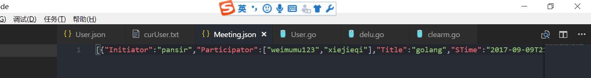
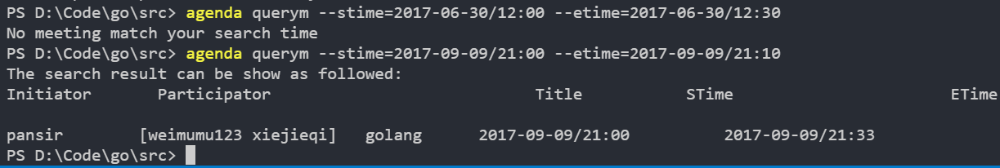

# Agenda
Golang_Agenda

#### How To Use

​	You can download agenda.exe to you PC. Then go into the path that include the agenda.exe and input something like agenda register ... (See more details in cmd-design.cmd)

#### Test

* agenda register -u pansir -p pansir -e 3791879@qq.com -m 1568983980  

  We can see in User.json

  

  ​

* agenda login -u pansir -p pansir 

  We can see in curUser.txt 

* agenda logout 

  We can see in curUser.txt 

* agenda queryu 

*  agenda cm -t golang -p weimumu123,weimumu -s 2017-09-09/21:00 -e 2017-09-09/21:33 

  We can see in Meeting.json 

* agenda addp -t golang -p zhengpin,xiejieqi 

  We can see in Meeting.json two participator were add to Meeting.json 

*  agenda delp -t golang -p weimumu,zhengpin 

  We can see in Meeting.json two participator were deleted 

* agenda querym --stime=2017-09-09/21:00 --etime=2017-09-09/21:10  

* agenda delm -t golang  

  We can see in Meeting.json this meeting is deleted 

* agenda login -u weimumu -p weimumu123 and agenda quitm -t golang 

  We can see in Meeting.json, weimumu was deleted from the meeing golang 

* agenda clearm 

  We can see in Meeting.json 

* agenda delu  

  We can see in Meeting.json all meeting that initiated by the user are deleted 

* about log. We can see in Operate.log 

  [info] means operate successfully

  [error] means operate will cause error

#### Thank!

